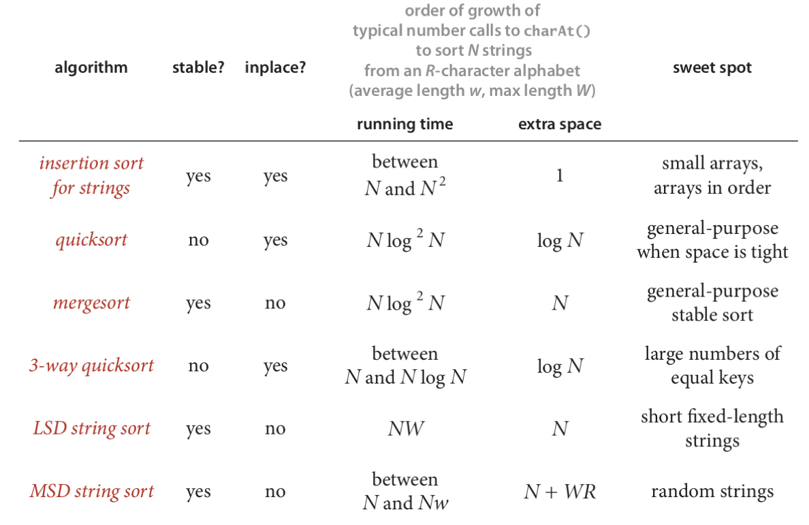

# Estrutura de Dados 1
Estudo rápido para prova (coisas que podem cair na minha cabeça)

## Análise de algoritmo 
### Função custo
- Constante -> F(n) = c
- linear -> F(n) = a * n + b
- quadrática -> F(n) = a * n ^ 2 + b * n + c
- cúbica -> F(n) = a * n ^ 3 + b * n ^ 2 + c * n + d
- exponencial -> F(n) = K ^ n
- fatorial -> F(n) = N!
- logaritmico -> F(n) = log n
- linearitmico -> F(n) = n log n

### Complexidade
- Interessada no tempo de exec de acordo com que n cresce.
- big O.
- **Exemplo:** Busca sequencial -> O(n), custo cresce no máximo de acordo com crescimento de n.
- Com o custo de F(n) = 4 * n ^ 2 + 4 * n + 1, **complexidade -> O(n ^ 2).**

---

## Ordenação de Dados
Organização otimiza as buscas, mais previsibilidade.

- Complexidade (espacial e temporal) 
    - Quadrático -> simples e suficiente para arquivos pequenos. 
    - Linearítmicos -> complexos e eficientes para arquivos grandes. 

### Selection Sort
Começa no início do vetor, buscando nos proximos, menores que o atual. E trocando.

- Complexidade -> O(N ^ 2).
- Custo -> Quadrática.
- Não adaptativo.
- Não estável.
- In-place -> Não utiliza memória extra significativa.

### Bubble Sort
Acha o maior e coloca no **topo** (fim do vetor), assim que coloca um no topo, volta e faz todo o resto do vetor.

- Complexidade -> Pior, médio caso O(N ^ 2).
- Custo -> Quadrática.
- Adaptativo.
- Estável. Não troca os iguais.
- In-place -> Não utiliza memória extra significativa.

### Insertion Sort
Inserir cada elemento já na posição correta, com relação aos anteriores. Cada iteração (vetor parcialmente ordenado).

- Complexidade
    - Pior caso -> (N ^ 2) / 2
    - Médio caso -> (N ^ 2) / 4
- Adaptativo.
- Estável
- In-place

### Shell Sort

- No pior caso não é necessariamente quadrático.
- Adaptativo
- Não estável
- In-place

---

## Ordenação de Dados Eficiente

- Linerítmicos
    - O(n log n)
    - Melhor custo quando a ordenação é por comparação do valor da chave
    - Mais amplo (varias chaves com o mesmo algoritmo)
- Linearítmicos
    - O(n)
    - Mais restrito (Um tipo de chave)

### Merge Sort

Dividir e conquistar. Abordagem **Top-Down**, de uma lista gera sub listas. **RECURSIVAMENTE**

- Complexidade -> O(N log N). Pior e Médio caso
- Memória extra -> Proporcional a N
- Mantem ordem relativa

#### **Em sub-vetores menores, alterne para o Insertion Sort**
#### Testar se o vetor já está em ordem.

### Quick Sort

Um dos mais utilizados, simples, eficiente. Separa os elementos baseado em 1 elemento. Escolher um pivô. 

- Pivô -> Elemento mais a direita ou mais a esquerda.
- Laço para procurar elementos.
- Memória extra -> Proporcional a (Log N).
- Não estável.
- Médio -> n log n.

### Heap Sort

Usa fila de prioridade para ordenar elementos, sem necessidade de espaços extras

- Complexidade = O(n log n)
- In-place
- Não estável
- Não adaptativo

### Intro Sort

Importante organização de algoritmos de ordenação. Pois é **HÍBRIDO**, com duas opções:

- quick + merge(Mais espaço) + insertion
- quick + heap(maior constante) + insertion

Solução para usar as eficiências e evitar as deficiências de cada um:

- Insertion -> **ADAPTATIVO**
- Quick -> Bom desempenho na maioria dos casos e inplace (- memória extra)
- Merge e Heap -> Desempenho previsível para todos os casos
- Quando a profundidade da recusrividade atinge um máximo estipulado alterna-se para outro método de ordenação
- Complexidade no **pior caso**: O(n log n)
- In-place 
    - Merge: Espaço extra, proporcional a N.
    - Heap e quick: **IN-PLACE**
- Não estável
- Não adaptativo

### Counting Sort

- Linearítmicos
    - O(n log n)
    - Ordenação por comparação do valor das chaves
- Lineares
    - O(n)
    - Ordenação por comparação das partes de formam as chaves

1. Contar frequência das chaves 
2. Calcular as posições das frequências
3. Distribuir as chaves

- Complexidade no pior caso: O(N + R)
    - N: Número de chaves
    - R: Intervalo das chaves
- Não in-place
- Estável
- Não adaptativo

### Radix Sort

Ordenar pela raix(radix) da representação dos dados. Decompor as estruturas

- Envolve operações custosas
- Alternativa: Decompor por bytes.

---

## Resumo das Ordenaçoes Existentes

