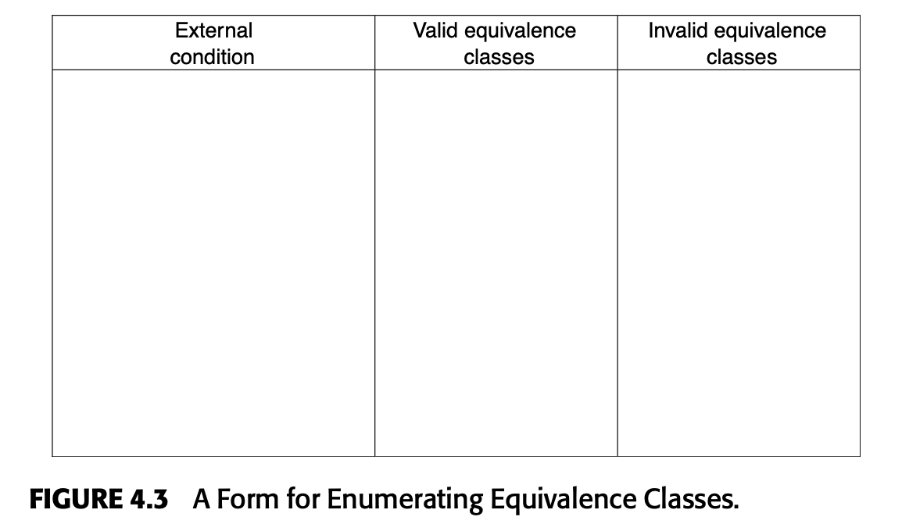

## Black Box

When testing you're limited to a small subset of all possibles inputs, so to weel-select a test case we should have two other properties:

1. It reduces, by more than a count of one, the number of other test
cases that must be developed to achieve some predefined goal.
2. It covers a large set of other possible test cases, that is tell us something about the presence or absence of errors over and above this specific set of input values.

- To number 1, implies that each test case should invoke as
many different input considerations as possible to minimize the total number of test cases necessary.
- To number 2, implies that you should try to partition the input domain of a program into a finite number of equivalence classes such that you can reasonably assume (but, of course, not be absolutely sure) that a test of a representative value of each class is equivalent
to a test of any other value.
- If a test case did not detect an error, we would expect that no other test cases in the equivalence class would fall within another equivalence class.

So we consider two things, **equivalence partitioning** and the second is to develop a set of "interesting" conditions to be tested.

## Equivalence Partitioning

Proceeds in two steps:

1. Identifyign the equivalence classes
2. Defining the test cases

### Identifying the Equivalence Classes

They're identified by taking each input condition.(usually a sentence or phrase in the specification) and partitioning it into two or more groups. We can use the figure above to do this.

We have two types of equivalence classes, **valid equivalence** and **invalid equivalence**. 

> We're paying more attention on invalid or unexpected conditions.

#### Given a inout or external condition

Follow these guidelines:

1. If an input condition specifies a range of values (e.g., ‘‘the item
count can be from 1 to 999’’), identify one valid equivalence classe(1<item count<999) and two invalid equivalence classes
(item count<1 and item count>999).
2. If an input condition specifies the number of values (e.g., ‘‘one through six owners can be listed for the automobile’’), identify one valid equivalence class and two invalid equivalence classes (no owners and more than six owners).
3. If an input condition specifies a set of input values, and there is
reason to believe that the program handles each differently (‘‘type of vehicle must be BUS, TRUCK, TAXICAB, PASSENGER, or MOTORCYCLE’’),identify a valid equivalence class for each and one invalid equivalence class (‘‘TRAILER,’’ for example).
4. If an input condition specifies a ‘‘must-be’’ situation, such as ‘‘first character of the identifier must be a letter,’’ identify one valid equivalence class (it is a letter) and one invalid equivalence class (it is not a letter).

The reason that individual test cases cover invalid cases is that certain erroneous-input checks mask or supersede other erroneous-input checks. For instance, if the specification states ‘‘enter book type (HARDCOVER, SOFTCOVER, or LOOSE) and amount (1–999),’’ the test case, (XYZ 0), expressing two error conditions (invalid book type and amount) will probably not exercise the check for the amount, since the program may say ‘‘XYZ IS UNKNOWN BOOK TYPE’’ and not bother to examine the remainder of the input.

## Boundary Value Analysis (Análise de borda)

Boundary conditions are those situations directly on, above, and beneath the edges of input equivalence classes and output equivalence classes. Differs from **quivalence partitioning** in two respects:

1. Rather than selecting any element in an equivalence class as being representative, boundary value analysis requires that one or more elements be selected such that each edge of the equivalence class is the
subject of a test.
2. Rather than just focusing attention on the input conditions (input
space), test cases are also derived by considering the result space
(output equivalence classes).

> It is difficult to present a "cookbook" for boundary value analysis, since requires a degree of creativity and certain amount of specialization towards the problem at hand.

## Cause-Effect Graphing

One weakness of boundary value analysis and equivalence partitioning is that they do not explore combinations of input circumstances.

- If (the program runs out of memory, for example).

1. The specification is divided into workable pieces. This is necessary because cause-effect graphing becomes unwieldy when used on large specifications. For instance, when testing an e-commerce system, a workable piece might be the specification for choosing and verifying a single item placed in a shopping cart. When testing a Web page design, you might test a single menu tree or even a less complex navigation sequence.
2. The causes and effects in the specification are identified. A cause is a distinct input condition or an equivalence class of input conditions.
An effect is an output condition or a system transformation (a lingering effect that an input has on the state of the program or system). For instance, if a transaction causes a file or database record to be
updated, the alteration is a system transformation; a confirmation
message would be an output condition.
You identify causes and effects by reading the specification word by
word and underlining words or phrases that describe causes and effects.
Once identified, each cause and effect is assigned a unique number.
3. The semantic content of the specification is analyzed and transformed into a Boolean graph linking the causes and effects. This is
the cause-effect graph.
4. The graph is annotated with constraints describing combinations of
causes and/or effects that are impossible because of syntactic or environmental constraints.
5. By methodically tracing state conditions in the graph, you convert
the graph into a limited-entry decision table. Each column in the
table represents a test case.
6. The columns in the decision table are converted into test cases.

